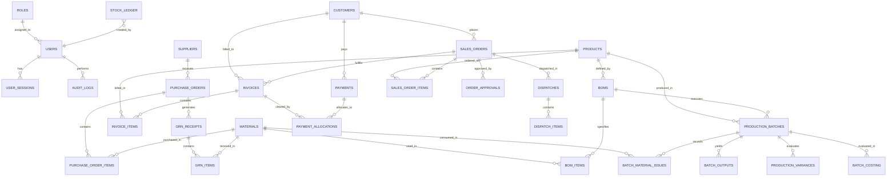

# DATABASE ENTITY RELATIONSHIP DESIGN
## Stockledger

### 1. Complete Entity-Relationship Diagram (Mermaid)

```mermaid
erDiagram
    USERS ||--o{ USER_SESSIONS : has
    USERS ||--o{ AUDIT_LOGS : performs
    ROLES ||--o{ USERS : assigned_to

    CUSTOMERS ||--o{ SALES_ORDERS : places
    CUSTOMERS ||--o{ INVOICES : billed_to
    CUSTOMERS ||--o{ PAYMENTS : pays

    SUPPLIERS ||--o{ PURCHASE_ORDERS : receives
    PURCHASE_ORDERS ||--o{ PURCHASE_ORDER_ITEMS : contains
    PURCHASE_ORDERS ||--o{ GRN_RECEIPTS : generates
    GRN_RECEIPTS ||--o{ GRN_ITEMS : contains

    PRODUCTS ||--o{ BOMS : defined_by
    PRODUCTS ||--o{ SALES_ORDER_ITEMS : ordered_in
    PRODUCTS ||--o{ INVOICE_ITEMS : billed_in
    PRODUCTS ||--o{ PRODUCTION_BATCHES : produced_in

    MATERIALS ||--o{ BOM_ITEMS : used_in
    MATERIALS ||--o{ PURCHASE_ORDER_ITEMS : purchased_in
    MATERIALS ||--o{ GRN_ITEMS : received_in
    MATERIALS ||--o{ BATCH_MATERIAL_ISSUES : consumed_in

    BOMS ||--o{ BOM_ITEMS : specifies
    BOMS ||--o{ PRODUCTION_BATCHES : executes

    PRODUCTION_BATCHES ||--o{ BATCH_MATERIAL_ISSUES : records
    PRODUCTION_BATCHES ||--o{ BATCH_OUTPUTS : yields
    PRODUCTION_BATCHES ||--o{ PRODUCTION_VARIANCES : evaluates
    PRODUCTION_BATCHES ||--o{ BATCH_COSTING : evaluated_in

    SALES_ORDERS ||--o{ SALES_ORDER_ITEMS : contains
    SALES_ORDERS ||--o{ ORDER_APPROVALS : approved_by
    SALES_ORDERS ||--o{ INVOICES : fulfills
    SALES_ORDERS ||--o{ DISPATCHES : dispatched_in

    INVOICES ||--o{ INVOICE_ITEMS : contains
    INVOICES ||--o{ PAYMENT_ALLOCATIONS : cleared_by

    PAYMENTS ||--o{ PAYMENT_ALLOCATIONS : allocates_to

    DISPATCHES ||--o{ DISPATCH_ITEMS : contains

    STOCK_LEDGER }o--|| USERS : created_by
```
