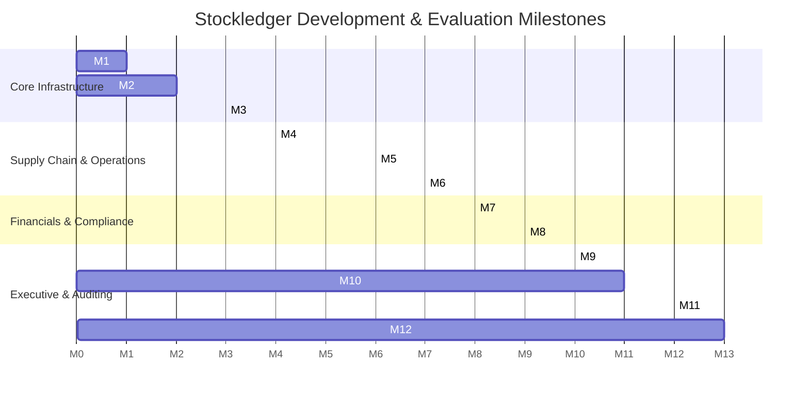

# DEVELOPMENT ROADMAP & MILESTONE VERIFICATION PLAN
## Stockledger

### Roadmap Overview (12 Milestones)

```mermaid
gantt
    title Stockledger Development & Evaluation Milestones
    dateFormat  X
    axisFormat  M%s
    section Core Infrastructure
    M1: Analysis & Architecture        :active, 0, 1
    M2: Database Schema & ER Model     :crit, 1, 2
    M3: Auth & RBAC Security           :2, 3
    section Supply Chain & Operations
    M4: Inventory Ledger & Purchase    :3, 4
    M5: BOM & Production Engine        :5, 6
    M6: Sales & Order Approval         :6, 7
    section Financials & Compliance
    M7: GST Invoices & Dispatch        :7, 8
    M8: Product Costing & Payments     :8, 9
    section Executive & Auditing
    M9: Dashboards & Financial Reports :9, 10
    M10: Test Automation & Benchmark   :crit, 10, 11
    M11: UI Polish & Documentation     :11, 12
    M12: Evaluator Simulation          :crit, 12, 13
```
